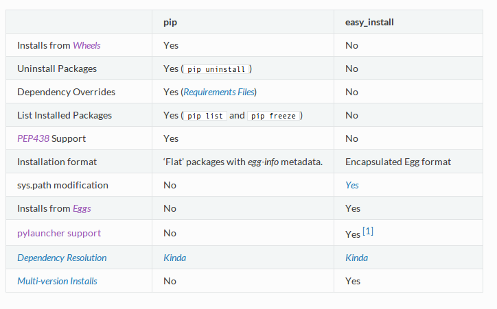

Packaging
---------

-----------------------------------------------------

* What is a distribution/package?
* How to create?
* How to distribute?
* How to install?

https://packaging.python.org

-----------------------------------------------------

Goals
~~~~~

* package creation including metadata, Python code & binary dependencies
* distribute
* install
* dependency management

-----------------------------------------------------

Introduction
~~~~~~~~~~~~~~

A bit of history
^^^^^^^^^^^^^^^^^^

* 2000 ``distutils`` introduced in Python 1.6
    * no dependency management
    * no consistant way to reproduce installation
    * not all metadata is handled
    * still the default packaging library included in the std. lib.
* 2001 PEP 241: metadata of distributions
* 2002-2003 PEP 301: PyPI

-----------------------------------------------------

* 2004 ``setuptools``
    * based on ``distutils``
    * no way to uninstall packages
    * dependency management
    * introduces the Egg format and ``easy_install``
    * is not part of Python's standard library

-----------------------------------------------------

* 2008 ``distribute`` was introduced as a fork of ``setuptools``
    * ... was merged back to setuptools 0.7
    * ``distribute2``: the aim was to replace distutils with all the functionalities introduced in previous attempts
    * included in Python 3.3 beta release
    * in 2012 it gets abandoned

-----------------------------------------------------

* 2013 PyPA team maintains the "Python Packaging User Guide"
* 2014 ``pip`` evolves
    * does not require setuptools
    * available as a wheel
    * included in Python 3.4
* 2014 ``pyvenv`` is available in Python 3.4

-----------------------------------------------------

Read more:

* https://packaging.python.org/en/latest/history.html
* http://stackoverflow.com/questions/6344076/differences-between-distribute-distutils-setuptools-and-distutils2

-----------------------------------------------------

Rule of thumb
^^^^^^^^^^^^^^^^^^

https://docs.python.org/3.4/installing/index.html

* ``pip`` is the preferred installer program
* ``pyvenv`` is the standard tool for creating virtual environments
* ``setuptools`` is the preferred way of creating distribution packages
* PyPI is used for publishing open source Python packages
* Wheels are a sort of standard

-----------------------------------------------------

Glossary
^^^^^^^^^

Distribution package

* a versioned archive file containing packages, modules (aka. package, distribution)
* end user can download and install it

Built distribution

* contains files and metadata
* can be directly deployed to the target OS
* Python files do not have to be precompiled

-----------------------------------------------------

Source distribution

* contains only metadata and source files
* a build distribution can be built from them
* can be generated with ``python setup.py sdist``

Binary distribution

* a specific build distribution
* contains compiled extensions as well

-----------------------------------------------------

Package formats
~~~~~~~~~~~~~~~~

-----------------------------------------------------

Eggs
^^^^^^^^^

* ~ Java jars: binary format (zip file)
* ``python setup.py bdist``
* bundles additional metadata
* enables the system to satisfy dependencies on runtime
* plugin mechanism
* may contain C extensions => not really platform independent
* zero installation (copy the .egg file)

-----------------------------------------------------

**Wheels**
^^^^^^^^^^^
This is becoming the new standard: (PEP 427)

* zip format archive  (.whl)
* ``bdist_wheel``
* installation format (do not include .pyc files)
* implements PEP 345,376 (metadata, database format)
* support multiple Python versions
* versioned
* intended to replace the Egg format

-----------------------------------------------------

**Universal Wheels** are wheels that are pure python (i.e. contains no compiled extensions) and support Python 2 and 3. This is a wheel that can be installed anywhere by pip.

.. code-block:: bash

    $ python setup.py bdist_wheel --universal

-----------------------------------------------------

**Pure Python Wheels** that are not “universal” are wheels that are pure python (i.e. contains no compiled extensions), but don’t natively support both Python 2 and 3.

.. code-block:: bash

    $ python setup.py bdist_wheel

-----------------------------------------------------

**Platform Wheels** are wheels that are specific to a certain platform like linux, OSX, or Windows, usually due to containing compiled extensions.

.. code-block:: bash

    $ python setup.py bdist_wheel

Naming of platform wheels: https://www.python.org/dev/peps/pep-0425/

-----------------------------------------------------

You'll need a ``setup.py`` for creating a distribution package...

.. code-block:: bash

    python setup.py sdist # Source distribution

    python setup.py bdist # Egg

    python setup.py bdist_wheel # Wheel

    python setup.py build # compile

    python setup.py install # install package

    python setup.py install --user # install package to the user home dir.

    python setup.py develop # symlink package

-----------------------------------------------------

Installation tools
~~~~~~~~~~~~~~~~~~~

``easy_install``

Let's you automatically download (from PyPI), build and install packages (which are Eggs)

``pip``

An **enhanced** tool for installing and managing Python packages involving repository support, uninstall, upgrade, ...

-----------------------------------------------------

-----------------------------------------------------

Prefer ``pip``
^^^^^^^^^^^^^^^

* All packages are downloaded before installation. Partially-completed installation doesn’t occur as a result.
* Care is taken to present useful output on the console.
* The reasons for actions are kept track of. For instance, if a package is being installed, pip keeps track of why that package was required.
* Meaningful error messages should be useful.

-----------------------------------------------------

* The code is relatively concise and cohesive, making it easier to use programmatically.
* Native support for other version control systems (Git, Mercurial and Bazaar)
* Uninstallation of packages.
* Simple to define fixed sets of requirements and reliably reproduce a set of packages.

-----------------------------------------------------

Creating packages
~~~~~~~~~~~~~~~~~~

1. ``distutils``
    * part of the std. lib.
    * lacks features
    * deprecated
2. ``setuptools``
    * improves on ``distutils``

-----------------------------------------------------

Components
~~~~~~~~~~~

(We use ``setuptools``)

* a top-level package (not always required)
* ``setup.py``

Additionally,

* ``README``
* ``setup.cfg``

-----------------------------------------------------

Directory structure
^^^^^^^^^^^^^^^^^^^^

.. code-block:: text

    sampleproject/
    |-- DESCRIPTION.rst
    |-- README.rst
    |-- setup.py
    |-- setup.cfg
    |-- simple
    |   |-- __init__.py
    |   |-- __main__.py
    |-- tests
    |-- |-- __init__.py
    |-- |-- test_simple.py

-----------------------------------------------------

``setup.py``
^^^^^^^^^^^^^^^^^^^^

.. code-block:: python

    from setuptools import setup, find_packages
    from os import path

    here = path.abspath(path.dirname(__file__))

    with open(path.join(here, 'DESCRIPTION.rst'), encoding='utf-8') as f:
        long_description = f.read()

-----------------------------------------------------

.. code-block:: python

    setup(
        name='sample',
        version='1.2.0',
        description='A sample Python project',
        long_description=long_description,
        url='https://github.com/pypa/sampleproject',
        author='The Python Packaging Authority',
        author_email='pypa-dev@googlegroups.com',
        license='MIT',
        classifiers=[
            'Development Status :: 3 - Alpha',
            'Intended Audience :: Developers',
            'Topic :: Software Development :: Build Tools',
            'License :: OSI Approved :: MIT License',
            'Programming Language :: Python :: 3.4',
            ],

-----------------------------------------------------

.. code-block:: python

        keywords='sample setuptools development',
        packages=find_packages(exclude=['contrib', 'docs', 'tests*']),
        install_requires=['peppercorn'],
        package_data={
            'sample': ['package_data.dat'],
        },
        entry_points={
            'console_scripts': [
                'myscript=simple:__main__.main',
            ],
        },
        )

https://pythonhosted.org/setuptools/setuptools.html#basic-use

-----------------------------------------------------

Some conventions:

* name: PEP426
* version: PEP440

An example project: https://github.com/pypa/sampleproject

-----------------------------------------------------

Building with ``setup.py``
^^^^^^^^^^^^^^^^^^^^^^^^^

.. code-block:: bash

    # installs a locally editable version
    # (same as ``pip install -e``)
    $ python setup.py develop
    # creates a source distribution
    $ python setup.py sdist
    # creates a (platform) wheel distribution
    $ python setup.py bdist_wheel
    # creates a universal dist. which works with both
    # Python 2 and 3 and do not have any C extension
    $ python setup.py bdist_wheel --universal

-----------------------------------------------------

Upload to PyPI
^^^^^^^^^^^^^^^

https://packaging.python.org/en/latest/distributing.html#uploading-your-project-to-pypi

``$ python setup.py upload``

``$ twine upload``

``$ python setup.py sdist bdist_wheel upload``

-----------------------------------------------------

Future
~~~~~~

https://packaging.python.org/en/latest/future.html
