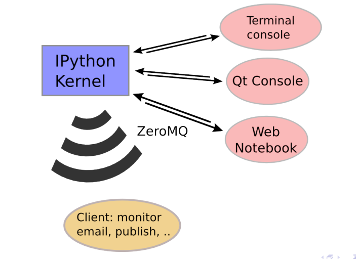

IPython / Jupyter
------------------

------------------------------------------------------------

Overview
~~~~~~~~~

**I** nteractive **Python** is an enhanced Python console, with

* tab completion (in many contexts!)
* object exploration
* integrated debugger
* history management
* system shell integration
* *magic functions*

``%quickref``

------------------------------------------------------------

IPython notebook
~~~~~~~~~~~~~~~~~

* **interactive Pthon console in your browser**
* can display inline html and images
* you can take notes
* export functions

------------------------------------------------------------

.. image::
    ipython_screener.png

------------------------------------------------------------

Architecture
~~~~~~~~~~~~

------------------------------------------------------------

Object exploration
~~~~~~~~~~~~~~~~~~

.. code-block:: ipython

    In [3]: import os
    In [4]: ?os
    Type:       module
    String Form:<module 'os' from '/usr/lib/python2.7/os.pyc'>
    File:       /usr/lib/python2.7/os.py
    Docstring:
    OS routines for Mac, NT, or Posix depending on what system we're on.

    This exports:
    - all functions from posix, nt, os2, or ce, e.g. unlink, stat, etc.
    - os.path is one of the modules posixpath, or ntpath
    - os.name is 'posix', 'nt', 'os2', 'ce' or 'riscos'
    ...

------------------------------------------------------------

History
~~~~~~~

.. code-block:: txt

    _i, _ii, _iii    : Previous, next previous, next next previous input
    _i4, _ih[2:5]    : Input history line 4, lines 2-4
    exec _i81        : Execute input history line #81 again
    %rep 81          : Edit input history line #81
    _, __, ___       : previous, next previous, next next previous output
    _dh              : Directory history
    _oh              : Output history
    %hist            : Command history. '%hist -g foo' search history for 'foo'

------------------------------------------------------------

Autocall
~~~~~~~~~

.. code-block:: txt

    f 1,2            : f(1,2)  # Off by default, enable with %autocall magic.
    /f 1,2           : f(1,2) (forced autoparen)
    ,f 1 2           : f("1","2")
    ;f 1 2           : f("1 2")

-----------------------------------------------------------

Shell integration
~~~~~~~~~~~~~~~~~~

Several commands are available by default (e.g ``ls, pwd, cd, rm, mkdir``)

.. code-block:: txt

    !cp a.txt b/     : System command escape by os.system()
    cp ${f}.txt $bar : Variable expansion
    files = !ls /usr : Capture sytem command output
    files.s          : "a b c"
    files.l          : ['a','b','c']
    files.n          : 'a\nb\nc'

------------------------------------------------------------

Magic functions
~~~~~~~~~~~~~~~~~~

* starts with ``%``, but it can be omitted

Managing history:

.. code-block:: txt

    In[1]: %save myfile 3-6 6-8
    The following commands were written to file `myfile.py`
    ...
    In[2]: %load myfile
    ...
    In[3]: %run myscript.py
    ...
    In[4]: %macro mymacro 3-4

------------------------------------------------------------

Other magic functions
~~~~~~~~~~~~~~~~~~~~~~

.. code-block:: txt

    %alias:
            Define an alias for a system command.
    %edit:
        Bring up an editor and execute the resulting code.
    %lsmagic:
            List currently available magic functions.
    %bookmark:
            Manage IPython's bookmark system.
    %timeit:
            Time execution of a Python statement or expression

------------------------------------------------------------

Debugging
~~~~~~~~~

``%run -d theprogram.py``

Profiling
~~~~~~~~~

``%run -p theprogram.py``

--------------------------------------------------------------------------

DEMO
====
