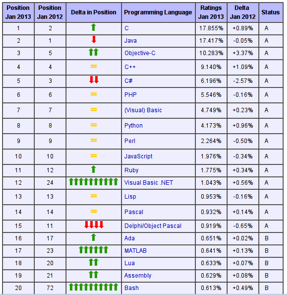

===================
Scripting languages
===================

----

About the lectures
------------------

-------

Aims
----

* to get a general picture about scripting languages
* basic knowledge in programming Python / Lua
* ability 
    * to learn new scripting languages
    * to use new technologies

----

Topics
--------

* Scripting languages in general
* Python language
    * basics
    * data structures, functions
    * modules, packages, I/O
    * OOP
* Pattern matching
* (GUI)
* Lua 
    * basics
    * *OOP*

----

Schedule
--------

11 lectures in the semester, not involving:

* 10 April -- out of office
* 17,24 April -- Holiday

Test: first week of June

-----

Grading
-------------

* presence on classes
* 1 final test (programming)
* 1-2 programming task (this can be your own project as well)
* regular homeworks (necessary!)

Contact
-------
http://users.itk.ppke.hu/~oroszgy

oroszgy@itk.ppke.hu

----

Revision
--------

Definitions
~~~~~~~~~~~

* compiler
* compiled programming languages
* assembly
* interpreter
* interpreted languages
* bytecode
* virtual machine
* garbage collector

----

Strong vs. weak type system
~~~~~~~~~~~~~~~~~~~~~~~~~~~

Strong
======

    "there are no loopholes in the type system"

Weak
====
    "the type system can be subverted (invalidating any guarantees)"
    
Read `this! <http://stackoverflow.com/questions/376611/why-interpreted-langs-are-mostly-ducktyped-while-compiled-have-strong-typing#376828>`_

-----

Dynamic vs. static type system
~~~~~~~~~~~~~~~~~~~~~~~~~~~~~~

Static 
=======

    "the type of each value is checked before the code being executed" (C/C++, JAVA, ...)
    
Dynamic
=======

    "the type of values are checked during the execution" (PHP, Python, ...)

--------
    
Examples
~~~~~~~~

C++
===
    * static typing
    * weak type system (e. g. casting a pointers to int!)
    * compiler(s)
    
JAVA
====
    * static type system
    * strongly typed
    * compiled (into bytecode)
    * virtual machine executes the bytecode

-----

Examples
~~~~~~~~

Python
======
    * dynamically typed
    * strongly typed
    * interpreter interprets the bytecode

-----

Scripting languages
-------------------

------

General attributes
-----------------------

Historical purpose: running applications with parameters

Nowadays:

* rapid developing, prototyping
* productivity
* easy integration
* simple syntax
* interpreted -- interactive interpeter
* dynamic typing
* weak type system
* automatic memory handling (GC)

----

Applications
------------
* OS facilities
* Web
* rapid prototyping in sciences
    * AI
    * NLP
    * bioinforamtics
* scripting
    * games
    * graphics
    * GUI
* gluing

----

Scripting languages
-------------------

* PHP, JavaScript, ActionScript
* R, Ruby
* Scala, Groovy
* Perl, Python, Lua
* Lisp,
* Rexx, TCL, BASH
* ...

----

Importance
-----------------------------------

